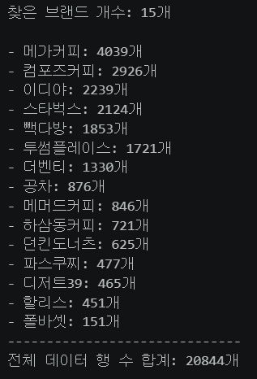

# 커피 브랜드 15지점 크롤링

## 🛠️ 기술 스택 및 개발 환경

- **Languege**: `Python 3.13`
- **Library**: `bs4`, `Selenium`, `Requests`, `Pandas`, `SQLAlchemy`
- **Database**: `Mysql`
- **IDE**: `Jupyter Notebook`

| 라이브러리 | 용도 | 비고 |
| :--- | :--- | :--- |
| **BeautifulSoup4** | HTML을 사용 | 데이터 파싱 |
| **Selenium** | 웹 페이지 접속(동적 페이지) | 스크롤 내리기, 다음 페이지 넘어가기 |
| **Requests** | 웹 페이지 접속(정적 페이지) | 서버와 http 통신 |
| **Pandas** | 컬럼 정의 및 데이터 전처리 | |
| **SQLAlchemy** | MySQL 연동 | |

## 📂 프로젝트 폴더 구조

```
├── coffee_crawling/           # 커피 체인점 크롤링 코드 파일 (총 15개)
│   ├── compose.ipynb          # 컴포즈커피 크롤링 코드
│   ├── dessert39.ipynb        # 디저트39 크롤링 코드
│   ├── dunkindonuts.ipynb     # 던킨도너츠 크롤링 코드
│   ├── ediya.ipynb            # 이디야 크롤링 코드
│   ├── gong-cha.ipynb         # 공차 크롤링 코드
│   ├── hasamdongcoffee.ipynb  # 하삼동커피 크롤링 코드
│   ├── hollys.ipynb           # 할리스 크롤링 코드
│   ├── mega_coffee.ipynb      # 메가커피 크롤링 코드
│   ├── mmthcoffee.ipynb       # 매머드커피 크롤링 코드
│   ├── paikdabang.ipynb       # 빽다방 크롤링 코드
│   ├── pascucci.ipynb         # 파스쿠찌 크롤링 코드
│   ├── paulbassett.ipynb      # 폴바셋 크롤링 코드
│   ├── starbucks.ipynb        # 스타벅스 크롤링 코드
│   ├── the_venti.ipynb        # 더벤티 크롤링 코드
│   ├── twosome_place.ipynb    # 투썸플레이스 크롤링 코드
│
├── EDA/
│   ├── mysql에_저장.ipynb     # Mysql 연동
│   ├── 총_지점갯수_확인.ipynb # 수집한 데이터 점검
```

## 🕷️ 크롤링 파일 상세 설명

- 수집은 15개 체인점 각각의 공식 사이트에서 html을 불러오는 방식으로 데이터 수집

| 카페 | 수집 데이터 항목 | 라이브러리 | 비고 |
| :--- | :--- | :--- | :--- |
| **스타벅스** | 매장코드, 매장명, 주소, 오픈날짜 | `Selenium`, `pandas`, `tqdm` | 지역 검색 |
| **투썸플레이스** | 지점ID, 매점명, 매점주소, 전화번호 | `Selenium`, `BeautifulSoup`, `pandas` | 무한 스크롤 |
| **이디야**| 매장명, 주소, 구| `Selenium`, `BeautifulSoup`, `pandas`, `certifi` | 매장명에 지역 검색 |
| **메가커피** | 매장명, 주소, 전화번호 | `re`, `urllib3`, `requests`, `BeautifulSoup`, `pandas` | 지역 검색 |
| **빽다방** | 지역, 매장명, 주소, 전화번호 | `Selenium`, `BeautifulSoup`, `pandas` | 페이지 넘김 |
| **컴포즈커피** | 지점ID, 매점명, 주소, 전화번호 | `re`, `certifi`, `selenium`, `BeautifulSoup`, `pandas` | 지역 검색 |
| **더벤티** | 매점명, 주소 | `requests`, `BeautifulSoup`, `pandas` | 페이지 넘김 |
| **공차** | 매장명, 주소, 전화번호 | `urllib3`, `requests`, `BeautifulSoup`, `pandas` | 페이지 넘김 |
| **디저트39** | 지점명, 주소 | `Selenium`, `BeautifulSoup`, `pandas` | 무한 스크롤 |
| **매머드커피** | 지역, 지점ID, 매점명, 주소 | `re`, `Selenium`, `BeautifulSoup`, `pandas` | 지역 검색 |
| **할리스** | 매장명, 주소 | `Selenium`, `BeautifulSoup`, `pandas` | 더보기 |
| **파스쿠찌** | 매점명, 지역, 주소 | `urllib3`, `requests`, `BeautifulSoup`, `pandas` | 페이지 넘김 |
| **폴바셋** | 매점명, 주소 | `Selenium`, `BeautifulSoup`, `pandas` | 지역 검색 |
| **하삼동커피** | 매장명, 주소 | `Selenium`, `BeautifulSoup`, `pandas` | 지역 검색 |
| **던킨도너츠** | 매장명, 주소, 지역 | `Selenium`, `pandas` | 지역 검색 |

## 📘 csv_file

```
├── total_subway.csv          # 전철역 최종 정제 파일
└── total_coffee.csv          # 커피 브랜드별 최종 정제 파일
```

-> 추후 csv파일에서 MySQL로 **sqlalchemy** 라이브러리를 사용하여 데이터베이스에 정제

## 🗄️ 커피 브랜드 데이터베이스 전처리 과정 및 최종스키마

- 데이터 베이스 : coffee_chain
- 15개의 체인점에서 전처리를 통해 **매장명**, **주소**만 추출
- 주소에서 첫번째 어절에 두글자만 추출해서 **지역** 컬럼에 삽입
    - 충청북도, 충청남도, 전북특별자치도, 전라남도, 경상북도, 경상남도 -> (충북, 충남, 전북, 전남, 경북, 경남)
- **브랜드명**의 경우는 브랜드별로 수집한 지점 데이터에서 미리 삽입 후 기재

| 컬럼(Column) | 타입 | 설명 |
| :--- | :--- | :--- |
| **브랜드명** | text ||
| **지역** | text ||
| **매장명** | text ||
| **주소** | text ||
| **위도** | double ||
| **경도** | double ||

## 🚃 전국 전철역 데이터베이스 전처리 과정 및 최종스키마

- 데이터 베이스 : total_subwat
- **공공데이터포탈** 오픈API를 통해 전철역 정보.xlsx 파일 다운로드 -> csv 파일로 변경
- 초기 파일 중 **역번호**, **역사명**, **노선명**, **역위도**, **역경도**, **운영기관명**, **주소** 컬럼만 남김
- (역사명 -> **역명**), (역위도, 역경도 -> **위도**, **경도**), (운영기관명 -> **철도운영기관**) 으로 각자 변경

- **1월 승하차이용객수**의 경우 csv파일에서 MySQL 테이블로 옮긴후 자료를 찾아 쿼리로 하나하나씩 삽입
- **지역**은 커피 브랜드 데이터와 같은 방법으로 데이터 수집

| 컬럼(Column) | 타입 | 설명 |
| :--- | :--- | :--- |
| **역번호** | text ||
| **지역** | text ||
| **노선명** | text ||
| **철도운영기관** | text ||
| **역명** | text ||
| **주소** | text ||
| **위도** | double ||
| **경도** | double ||
| **1월 승차이용객수** | bigint ||
| **1월 하차이용객수** | bigint ||

## 🌐 위도와 경도

1. geopy 라이브러리를 통한 추출
  - 주소를 통해 위도와 경도를 6자리의 소수로 추출
2. 카카오 개발자 모드를 통해 API를 호출한 후 주소를 통해 위도와 경도 추출

## 📁 EDA

- 총_지점갯수_확인.ipynb



## 🚀 향후 수집 계획

1. 15개의 브랜드 지점 외에 다른 카페 수집 예정
2. fastfood_crawling 파일을 만들어 패스트푸드(브랜드 10군데 정도) 전지점 크롤링 예정
3. 백화점, 아울렛 등 크롤링 예정
   - 파일명 : department_store_crawling, outlet_crawling

## ❓ FAQ

**Q : 수집한 데이터는 어디에 쓰이나요?**

**A : https://github.com/khg09065-debug/subway_archive 
    다음 레포지토리는 상권 성격을 분석하는 앱을 구현하였음으로 
    다음 데이터들을 통해 전철역 별로 상권의 성격이 어떤지 보여주기 위해 쓰입니다.**

**Q : 왜 csv파일을 통해서 저장을 하였나요?**

**A : 수집한 데이터를 csv파일로 확인 후 MySQL 테이블에 삽입하였기 때문에 시작점은 CSV파일이었기에 저장 하였습니다.**

**Q : 왜 커피 브랜드마다 따로 주피터 파일을 만들었나요?**

**A : 커피 브랜드별로 공식 사이트에서 수집하였으며 사이트마다 html구조가 달라서 커피 브랜드 하나마다
    주피터환경으로 파일을 만들어 브랜드별로 다른 크롤링 방법을 공부하기 위해 브랜드마다 따로 크롤링 파일을 만들었습니다.**
